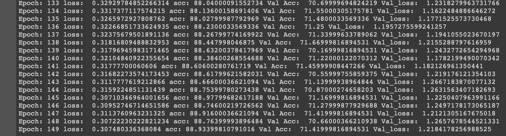
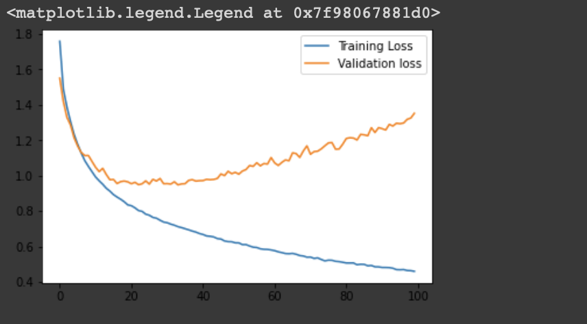

# Image Classification with CIFAR-10 dataset
In this notebook, I am going to classify images from the [CIFAR-10 dataset](https://www.cs.toronto.edu/~kriz/cifar.html).  The dataset consists of airplanes, dogs, cats, and other objects. You'll preprocess the images, then train a convolutional neural network on all the samples. The images need to be normalized. Some more interesting datasets can be found [here](http://rodrigob.github.io/are_we_there_yet/build/#datasets)

# Contents
##### 1. Get the Data
##### 2. Understanding the dataset
##### 3. Hands-on experience implementing normalize 
##### 4. Pytorch Basics
##### 5. Model Architecture and construction (Using different types of APIs (tf.nn, tf.layers, tf.contrib))
##### 6. Training the model
##### 7. Prediction

# 2. Understanding the dataset
The original a batch data is (10000 x 3072) dimensional tensor expressed in numpy array, where the number of columns, (10000), indicates the number of sample data. As stated in the [CIFAR-10/CIFAR-100 dataset](https://www.cs.toronto.edu/~kriz/cifar.html), the row vector, (3072) represents an color image of 32x32 pixels.

Since this project is going to use CNN for the classification tasks, the row vector, (3072), is not an appropriate form of image data to feed. In order to feed an image data into a CNN model, the dimension of the tensor representing an image data should be either (width x height x num_channel) or (num_channel x width x height).

It depends on your choice (check out the [tensorflow conv2d](https://www.tensorflow.org/api_docs/python/tf/nn/conv2d)). In this particular project, I am going to use the dimension of the first choice because the default choice in tensorflow's CNN operation is so.

The row vector (3072) has the exact same number of elements if you calculate 32\*32\*3==3072. In order to reshape the row vector, (3072), there are two steps required. The **first** step is involved with using **reshape** function in numpy, and the **second** step is involved with using **transpose** function in numpy as well.

# 5. Model Architecture

The entire model consists of 14 layers in total. In addition to layers below lists what techniques are applied to build the model.

1. Convolution with 6 different filters in size of (3x3)
2. Max Pooling by 3
  - ReLU activation function
3. Convolution with 16 different filters in size of (3x3)
4. Max Pooling by 2
  - ReLU activation function
5. Convolution with 64 different filters in size of (3x3)
  - ReLU activation function
7. Flattening the 3-D output of the last convolutional operations.
8. Fully Connected Layer with 120 units
9. Fully Connected Layer with 84 units
10. Fully Connected Layer with 10 units

the image below decribes how the conceptual convolving operation differs from the tensorflow implementation when you use [Channel x Width x Height] tensor format.

# 6. Training the model
achieving over 88.93% accuracy in 140 epochs through 5 batches.

# 7. Prediction

